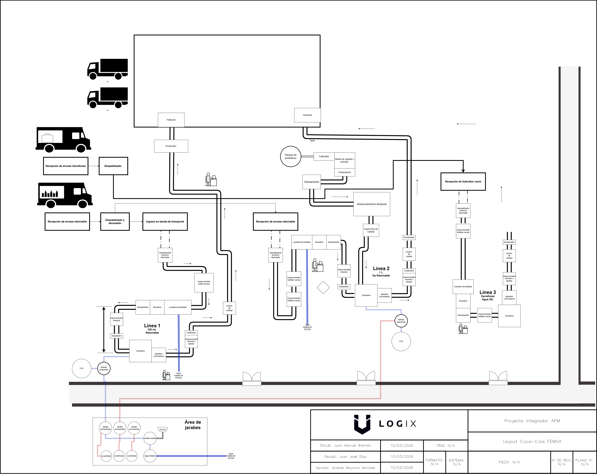

# planta — Diseño de Distribución en Planta

Diseño de la distribución física de la planta y planos de layout.

## Contenido esperado

- `layout/` — Planos 2D de distribución (Draw.io / AutoCAD / NX)
- `calculos/` — Cálculos de dimensionamiento, áreas y flujos de material

## Responsable

Juan Manuel Beltrán Botello · [@JuanBeltran2024](https://github.com/JuanBeltran2024)

