# proceso — Análisis del Proceso Productivo


Análisis del proceso de fabricación y despacho en la planta de bebidas FEMSA / Coca-Cola Fontibón, desde la recepción de insumos hasta el empaque y despacho. Desarrollado en el marco del **Módulo 1 — Introducción a la Automatización** del curso APM 2026-1.

## Líneas de Producción

| Línea | Producto | Envase | Volumen | Criterio de diferenciación |
|---|---|---|---|---|
| **Línea 1** | Bebida carbonatada | Vidrio retornable | 330 mL | Recepción retornable, lavado, saneamiento, inspección botella vacía (HEUFT SPECTRUM II SX-prewash), etiquetado, llenado (KRONES Modulfill HES), tapado |
| **Línea 2** | Bebida volumen medio | PET no retornable | 1.5 L | Cambio de familia de envase, soplado integrado (KRONES Contiform Bloc), llenado-cierre-etiquetado con diferencias en capacidad vs. línea retornable |
| **Línea 3** | Agua purificada | Garrafón retornable | 25 L | Gran volumen individual, tratamiento agua (KRONES Hydronomic), mayor exigencia sanitaria, tiempos unitarios mayores, logística diferenciada |

> Los tres productos cumplen el criterio C1 del proyecto integrador: diferencias en envase/geometría, velocidad de producción, secuencia lógica, inspección y recetas.


## Maquinaria de Referencia (Benchmark Industrial)

| Equipo | Fabricante | Función | Línea |
|---|---|---|---|
| Lavatec D / LavaClassic D | KRONES | Lavado de botellas retornables | L1 |
| HEUFT SPECTRUM II SX-prewash | HEUFT | Inspección y rechazo de retornables defectuosos antes del llenado | L1 |
| Modulfill HES | KRONES | Llenado higiénico bebidas carbonatadas en vidrio | L2 |
| Contiform Bloc | KRONES | Soplado + llenado integrado para envases PET hasta 3.5 L | L2 |
| Hydronomic | KRONES | Tratamiento y preparación de agua de proceso | L3 |
| HEUFT PRIME | HEUFT | Inspección envases llenos (fisicoquímica en línea) | L1, L2, L3 |

> Estas referencias se usan como benchmark técnico, no como confirmación del inventario exacto de la planta FEMSA visitada.


## DTP — Diagrama de Transformación de Producto

### Línea 1 — Vidrio retornable 330 mL

<p align="center">
  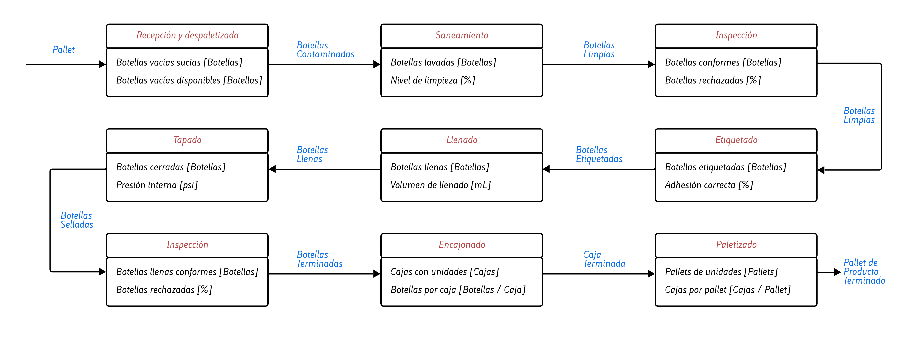
</p>

### Línea 2 — PET 1.5 L

<p align="center">
  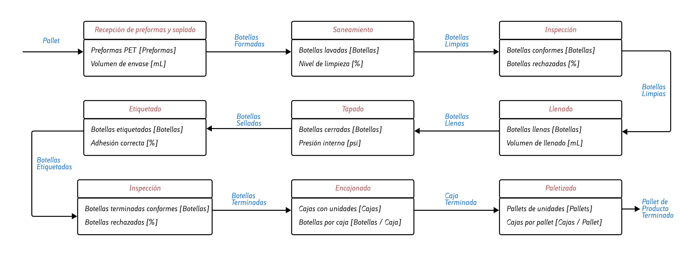
</p>

### Línea 3 — Garrafón 20 L

<p align="center">
  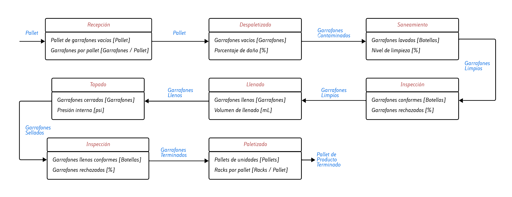
</p>

Los diagramas de transformación evidencian que las variables críticas del proceso se concentran en saneamiento (nivel de limpieza), llenado (volumen en mL), tapado (presión interna) y etiquetado (adhesión). Estas variables influyen directamente en la calidad del producto final, pero también en la velocidad de producción, ya que requieren control preciso y pueden generar rechazos. Se identifica que el llenado es una etapa sensible debido a la necesidad de mantener exactitud volumétrica y presión adecuada en bebidas gaseosas, lo cual puede reducir la disponibilidad efectiva del equipo por ajustes o mantenimiento. Asimismo, el proceso final de encajonado y paletizado representa una transformación logística que impacta significativamente el throughput total de la línea, especialmente al realizarse manualmente.

## DOP — Diagrama de Operaciones de Proceso

### Línea 1 — Vidrio retornable 330 mL

<p align="center">
  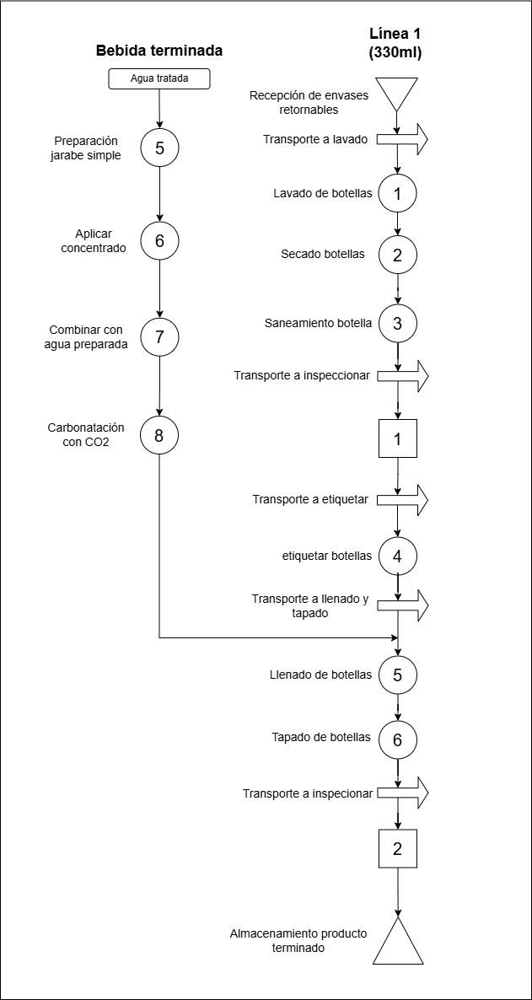
</p>

### Línea 2 — PET 1.5 L

<p align="center">
  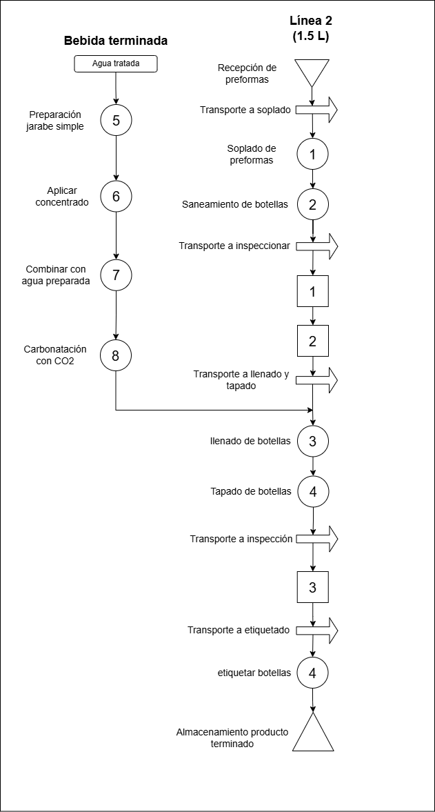
</p>

### Línea 3 — Garrafón 20 L

<p align="center">
  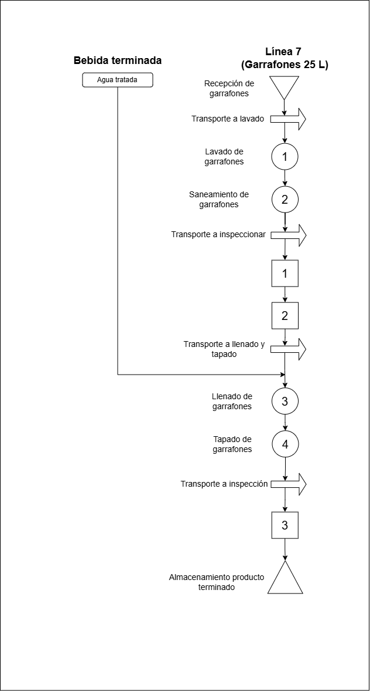
</p>

Los diagramas de análisis de proceso evidencian que una proporción significativa de las actividades corresponde a transporte (6) e inspección (2), mientras que solo 5 corresponden a operaciones que agregan valor directo al producto. Esto indica un potencial de mejora en la reducción de movimientos innecesarios mediante mejor distribución de planta o automatización del manejo de materiales. El tiempo más alto se observa en saneamiento de botellas y en la recepción de preformas, mientras que el llenado presenta un tiempo considerable en relación con otras operaciones productivas. La presencia de múltiples transportes intermedios incrementa el lead time total del proceso y sugiere que la eficiencia global puede incrementarse mediante integración de equipos o automatización del flujo entre estaciones.


## DAP — Diagrama de Análisis de Proceso

### Línea 1 — Vidrio retornable 330 mL

<p align="center">
  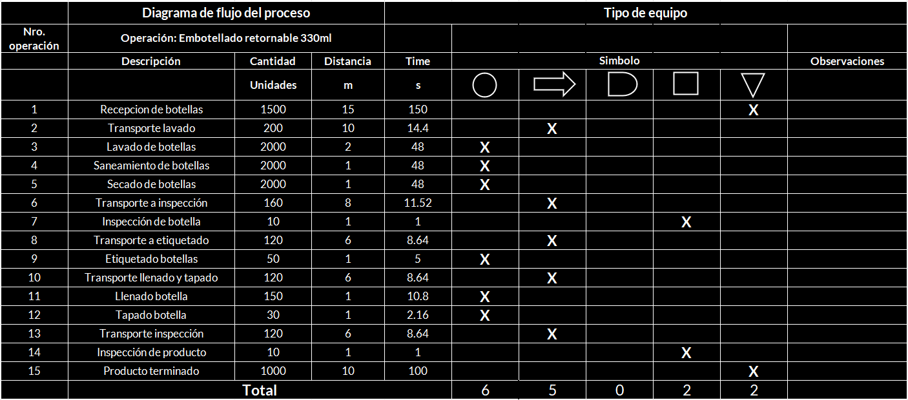
</p>

### Línea 2 — PET 1.5 L

<p align="center">
  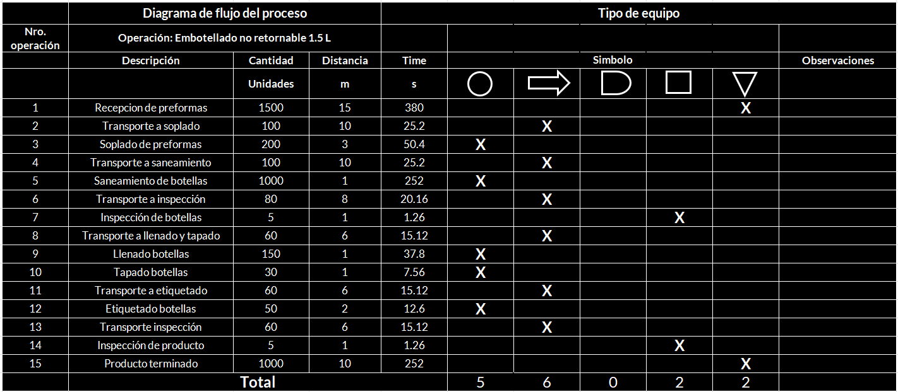
</p>

### Línea 3 — Garrafón 20 L

<p align="center">
  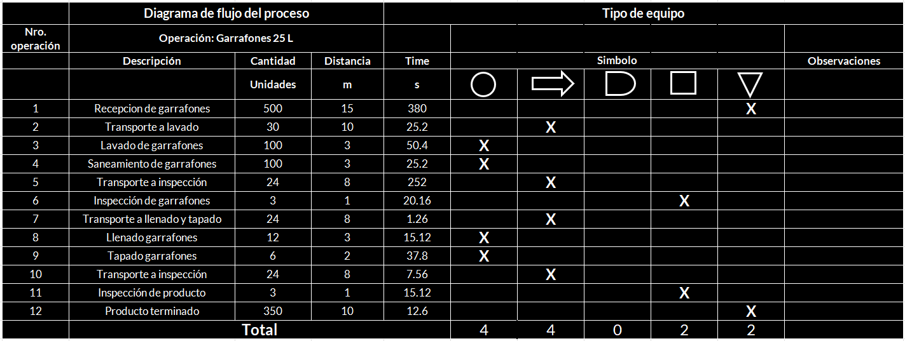
</p>

### Resumen Diagrama de Análisis de Proceso
| Línea | Operaciones | Transportes | Demoras | Inspecciones | Almacenamientos | Total |
|---|---|---|---|---|---|---|
| Línea 1 — 330 mL retornable | 6 | 5 | 0 | 2 | 2 | **15** |
| Línea 2 — PET 1.5 L | 5 | 6 | 0 | 2 | 2 | **15** |
| Línea 3 — Garrafón 25 L | 4 | 4 | 0 | 2 | 2 | **12** |

**Interpretación:** La Línea 1 tiene mayor carga de transportes e inspecciones previas al llenado (envase retornable). La Línea 2 concentra su flujo en acondicionamiento PET y llenado-cierre continuo. La Línea 3 tiene menos etapas pero mayor tiempo y exigencia sanitaria por unidad.


## VSM - Mapa de Flujo de Valor


### Línea 1 — Vidrio retornable 330 mL

<p align="center">
  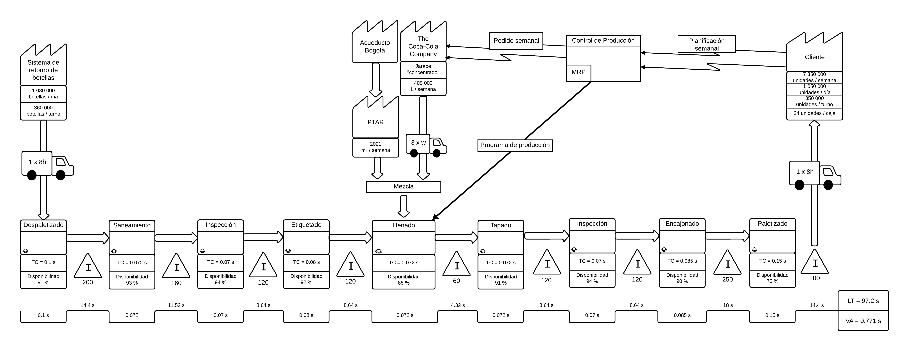
</p>

### Línea 2 — PET 1.5 L

<p align="center">
  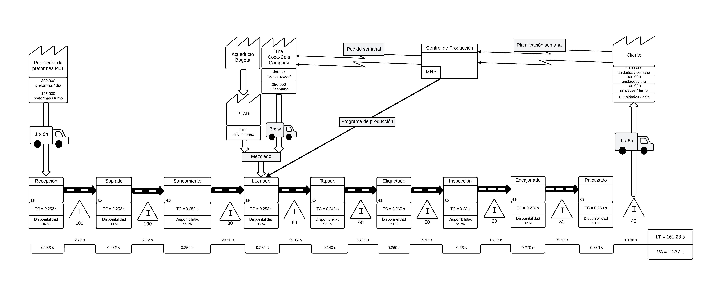
</p>

### Línea 3 — Garrafón 20 L

<p align="center">
  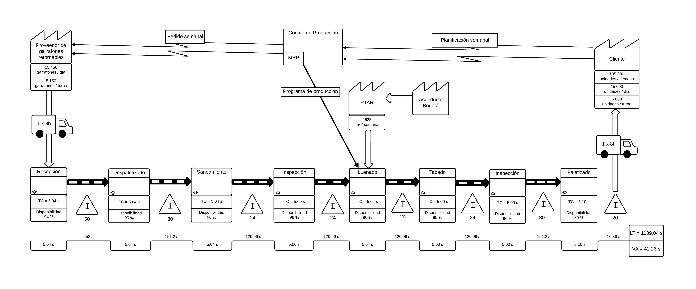
</p>


## Arquitectura ISA-95

La línea de producción se estructura según los niveles ISA-95:

```
Nivel 4  ERP / MRP — planificación semanal (pedido semanal → MRP)
Nivel 3  MES — Power BI, OEE, analítica Python (S. Sanchez / J. Triana)
Nivel 2  SCADA Ignition — supervisión y control proceso (J. Triana)
Nivel 1  PLC Studio 5000 / Logix Emulate — control secuencial (J. Díaz)
Nivel 0  Sensores / Actuadores — líneas L1, L2, L3
```


## Contenido de esta Carpeta

- `diagramas/` — DTP, DOP, DAP, P&ID
- `vsm/` — VSM estado actual y futuro por línea (ver `ulogix-data-finance/simulacion/vsm/`)
- `recetas/` — Parámetros de proceso y recetas por producto (Líneas 1, 2 y 3)

## Responsables

| Rol | Nombre | GitHub |
|---|---|:---:|
| Proceso / VSM / Recetas | Jorge Nicolas Garzón Acevedo | [@Nicolas-Eule](https://github.com/Nicolas-Eule) |
| Arquitectura ISA-95 / P&ID | Andrés Mauricio Morales Martínez | [@mora200217](https://github.com/mora200217) |
| **Supervisor de par** | **Juan Manuel Beltrán Botello** | [@JuanBeltran2024](https://github.com/JuanBeltran2024) |


