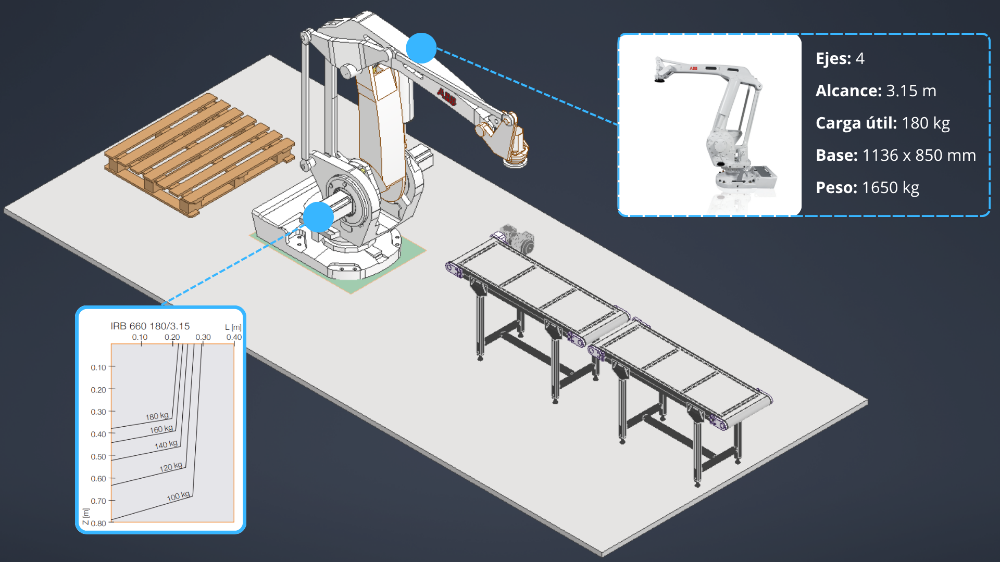

# robotstudio — Celda Robotizada ABB

## Propuesta preliminar

  

Celda robotizada que integra un transportador (Banda Transportadora del producto), robot articulado (ABB IRB 660), gripper tipo jaula y estación de pallets. El robot articulado de 4 ejes posee un alcance de 3.15 m, un peso de 1650 kg y carga útil de 180 kg que puede disminuir gradualmente hasta 100 kg de acuerdo a la gráfica mostrada en la imagen. El gripper tipo jaula permite cargar hasta 4 cajones de producto de manera simultánea. La estación de paletizado con esta configuración permite optimizar el proceso de producción gracias a la velocidad y desempeño de la celda robotizada.

## Contenido esperado

- `celdas/` — Diseño de la celda: layout, alcance, seguridad, periféricos
- `programas-rapid/` — Código RAPID de las rutinas del robot
- `analisis-riesgos/` — Evaluación de riesgos y medidas de mitigación (ISO 10218)

## Responsable

Andrés Felipe Quenan Pozo · [@Andres-Felipe-Quenan](https://github.com/Andres-Felipe-Quenan)

